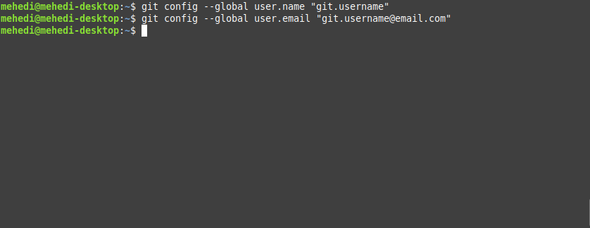
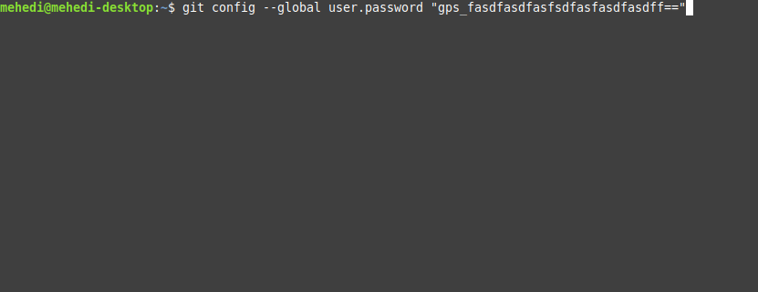
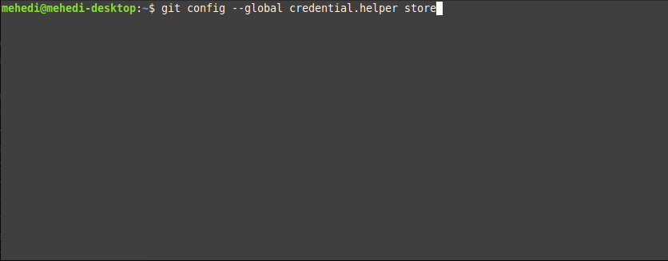
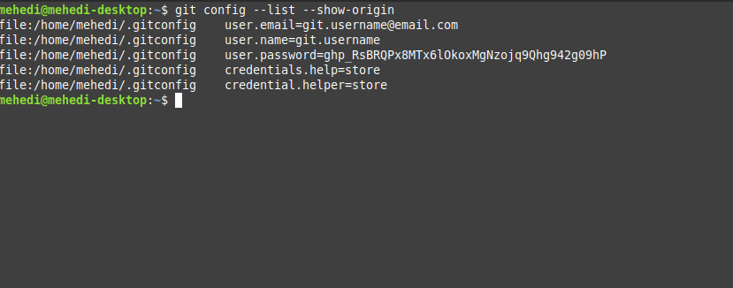

# Github Tutirials


## Set default credentials for github

* **Step 1 :** Open terminal for git access  


* **Step 2 :** Set username and email for git users
```bash
$ git config --global user.name "gitusername"
$ git config --global user.email "git.username@email.com"
```



* **Step 3 :** To set git creadentils for github
```bash
$ git config --global user.password "gps_fasdfasdfasfsdfasfasdfasdff="
```



* **Step 4 :** To save the credentils forever, use following
```bash
$ git config --global credential.helper store

```



* **Step 5 :** To check the inputs, type the below command as depicted
```bash
$ git config --list --show-origin

```
