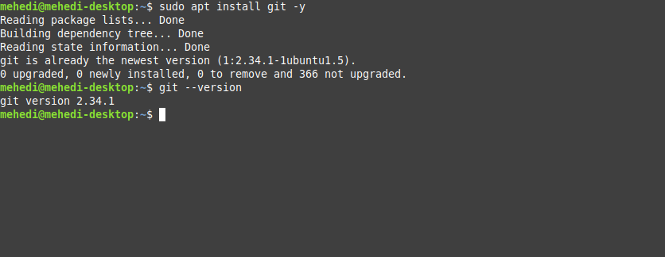

<div align="center">
    
    <h1>Git Documentation</h1>
    <strong>This git documentation specially depicts some of cool tutorilas which used in day to day life.</strong>
</div>

<br/>    


<!-- TOC -->

- [Introduction](#introduction)
- [Installation](#installation)
    - [Ubuntu](#ubuntu)
- [Tutorials](#tutorials)
    - [1. Set Default Credentials for Git](#1-set-default-credentials-for-git)
- [References:](#references)

<!-- /TOC -->

## Introduction
[Git](https://git-scm.com/) is free and open source software for distributed version control: tracking changes in any set of files, usually used for coordinating work among programmers collaboratively developing source code during software development.

## Installation
Git installation depends on operating system like linux,ubuntu,mac,windows. We will installing in major os

### Ubuntu
You will need an Ubuntu 20.04 server with a non-root superuser account. And following command
```bash
$ sudo apt update -y
$ sudo apt install git -y 
```

Check version of installed `git` which also depict in image.

```bash
$ git --version
```



## Tutorials
### [1. Set Default Credentials for Git](blogs/set_default_credentials_for_git.md)


## References:
* https://www.digitalocean.com/community/tutorials/how-to-install-git-on-ubuntu-20-04
* https://github.com/abhisheknaiidu/ricochet-frontend/blob/v2/README.md
