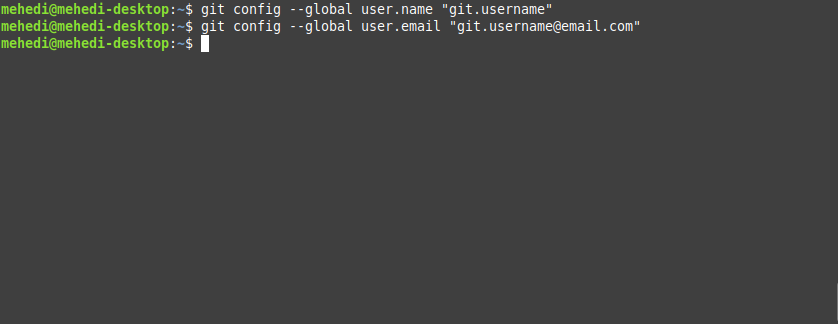
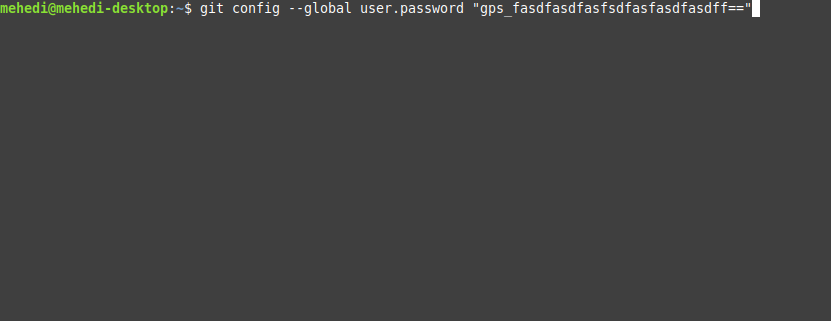
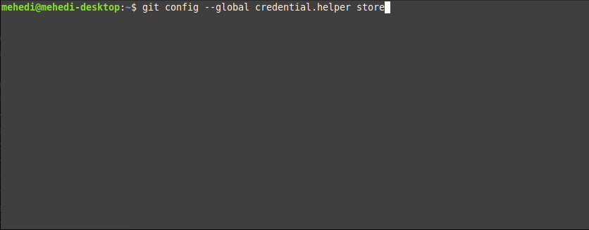
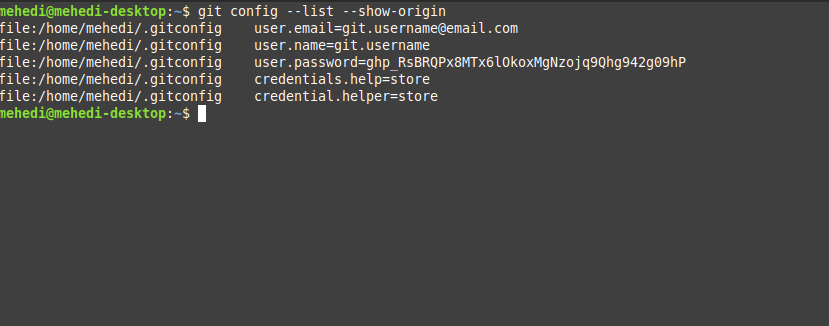

# Set Default Credentials for Git
<!-- TOC -->

- [Set Default Credentials for Git](#set-default-credentials-for-git)
    - [Set default credentials for github](#set-default-credentials-for-github)
        - [Step 1: Open terminal for git access](#step-1-open-terminal-for-git-access)
        - [Step 12: Set username and email for git users](#step-12-set-username-and-email-for-git-users)
        - [Step 3: To set git creadentils for github](#step-3-to-set-git-creadentils-for-github)
        - [Step 4: To save the credentils forever, use following](#step-4-to-save-the-credentils-forever-use-following)
        - [Step 5: To check the inputs, type the below command as depicted](#step-5-to-check-the-inputs-type-the-below-command-as-depicted)

<!-- /TOC -->

## Set default credentials for github

### Step 1: Open terminal for git access  


### Step 12: Set username and email for git users
```bash
$ git config --global user.name "gitusername"
$ git config --global user.email "git.username@email.com"
```



### Step 3: To set git creadentils for github
```bash
$ git config --global user.password "gps_fasdfasdfasfsdfasfasdfasdff="
```



### Step 4: To save the credentils forever, use following
```bash
$ git config --global credential.helper store

```



### Step 5: To check the inputs, type the below command as depicted
```bash
$ git config --list --show-origin

```
