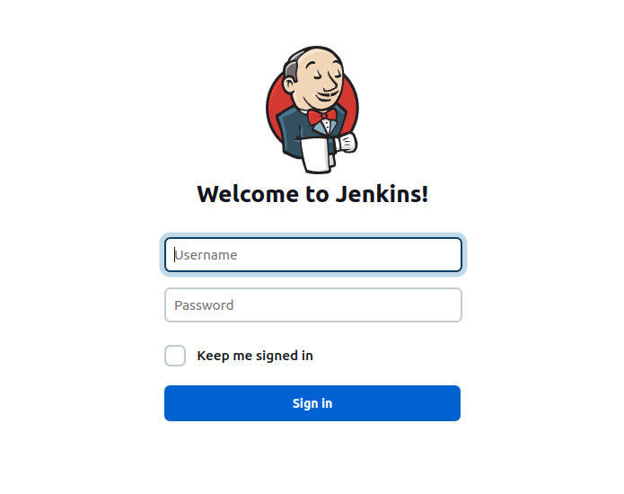
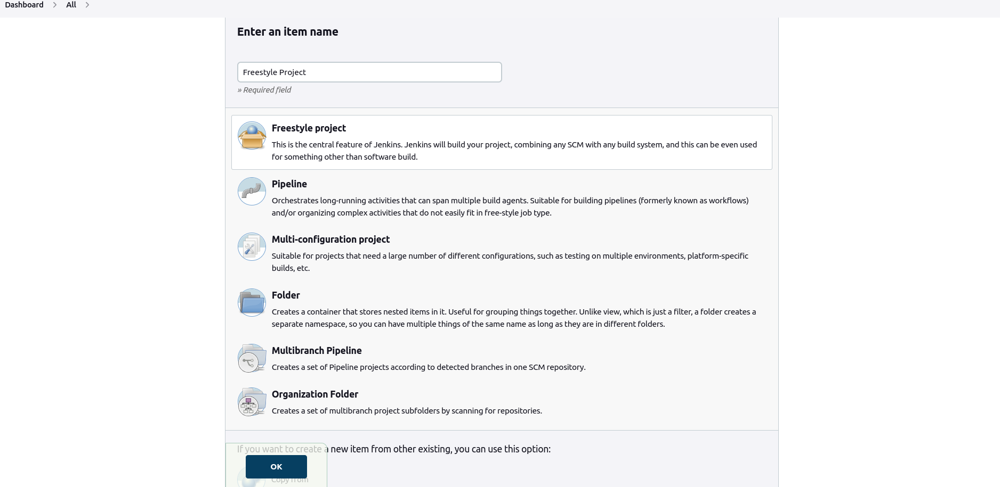

# Jenkins Totorial

## Introduction
Jenkins helps automate the parts of software development related to building, testing, and deploying, facilitating continuous integration and continuous delivery. It is a server-based system


## Architecture

## Prerequisite
Install and update prerequisite application

1. Install Jenkins for specific operating system
```bash
$ curl -fsSL https://pkg.jenkins.io/debian-stable/jenkins.io.key | sudo tee /usr/share/keyrings/jenkins-keyring.asc > /dev/null
echo deb [signed-by=/usr/share/keyrings/jenkins-keyring.asc] \
  https://pkg.jenkins.io/debian-stable binary/ | sudo tee \
  /etc/apt/sources.list.d/jenkins.list > /dev/null
$ sudo apt-get update -y
$ sudo apt-get install jenkins -y
```
2. Install Java Updated version in Jenkins agent if required

```bash
$ sudo apt update
$ sudo apt install openjdk-11-jre -y
$ java -version
```

## Tutorials

### Create a Freestyle Project
#### Steps 1: To create a freestyle project login to jenkins application with username and password.  


#### Steps 2: After login from dashboard click on **New Item** button. After enter a item name for freestyle projects name.  


#### Steps 3: It will create a new project and run according to configuration.


### Create a Pripeline Project in Declarative Pipeline
### Create a Pripeline Project with Github Jenkinsfile 
### Create a Pripeline Project for Docker Deployment
### Create a Pripeline Project for Kubernetes Deployment


## References:
* https://www.jenkins.io/doc/book/installing/linux/


